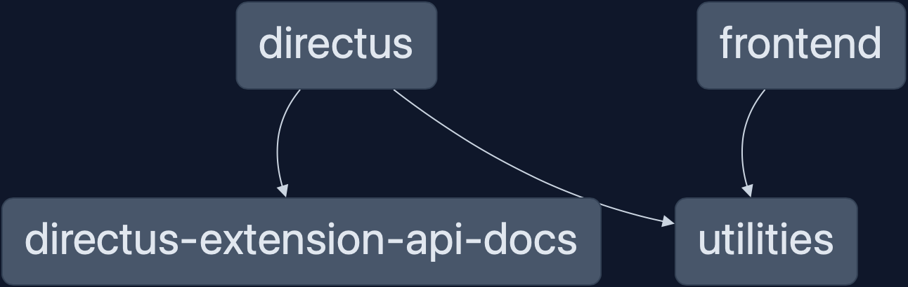

# Back-end server with web interface (byDirectus)

## Initialize

- create a new db
- configure `.env` file like .env.example
  - default for docker compose: `../configs/directus.env`

```
# docker compose --env-file ../configs/.env up -d
docker compose up -d
```

## Installation and CI

Build all packages:

```
pnpm build
```

Preparing db with Directus setup, snapshot and migrations & running service:

```
pnpm db:prepare
pnpm start
```

## Development



Running service (no installation) in watch mode:

```
pnpm dev
```

### Directus utils CLI

**Workdir `/directus`**

Utilities scripts (create roles migrations, translations, ...):

```
pnpm directus-x --help
```

#### Others

Some scripts:

- `pnpm snapshot:create` Create e new snapshot
- `pnpm snapshot:check` Print-out the planned changes (only from snapshot, not migrations)

### Frontend package

**Workdir `/frontend`**

### Common libraries or utils

**Workdir `/packages/*`**

### Project packages graph

```
pnpm graph
```

### Demo

`origin/main` deployed to:

- https://directus.sulla.pizza credentials: demo@directus.sulla.pizza / demo
- https://directus-fe.sulla.pizza
